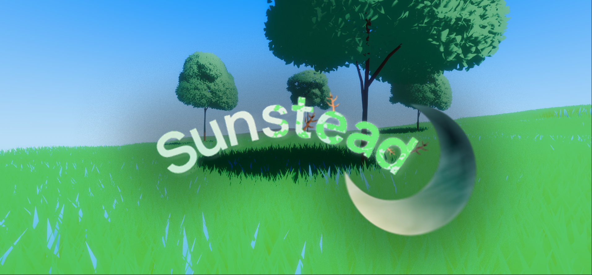

Hey, I'm Jake and I'm a developer / graphics programmer. 

 

🗣️ Now:
- [Researching / developing time based movement](https://github.com/JakeButf/NPCScheduler)

👥 Later:
- Grass caching / improve mesh based grass rendering
- Procedural terrain texture generation
- Procedural and controllable terrain height generation

🫂 Previously:
- Procedural Day/Night Skybox.
- Realtime Wii U memory save/load.
